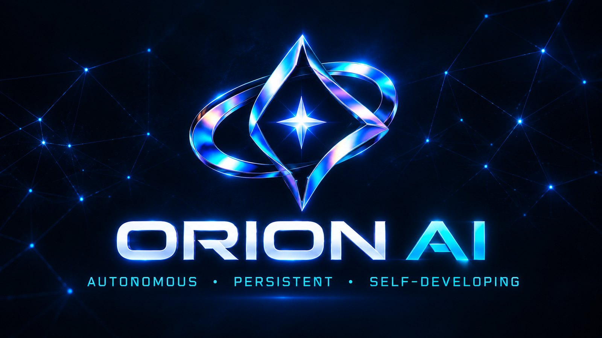

<div align="center">
  

  <br><br>

  

  <h1>Orion</h1>

  <p><strong>The AI assistant that lives on your computer.</strong><br>
  It talks, remembers and gets things done, and your conversations stay on your PC.</p>

  <p>
    <a href="https://github.com/AstraDev-Labs/Orion-AI/releases"></a>
    
    
    
  </p>

  <p>
    <a href="https://astradev-labs.github.io/Orion-AI/">Website</a> ·
    <a href="https://astradev-labs.github.io/Orion-AI/download">Download</a> ·
    <a href="https://astradev-labs.github.io/Orion-AI/system-requirements">Check your PC</a> ·
    <a href="https://astradev-labs.github.io/Orion-AI/docs">Docs</a>
  </p>
</div>

---

> [!WARNING]
> **Orion is alpha software and has bugs.** Replies can be wrong or slow, voice can mishear, and some features are unfinished. Please [report what breaks](https://github.com/AstraDev-Labs/Orion-AI/issues/new?labels=bug).

## Why Orion?

Most "personal" AI assistants send every request through someone else's servers. Local AI models are now good enough that, for a lot of everyday help, that isn't necessary. Orion runs its AI model, speech recognition and voice on your own Windows PC, and only goes online when a task needs it.

- **Runs on your computer.** A local AI model (Qwen via Ollama) does the thinking. No account, no subscription, no usage analytics.
- **Talk or type.** Local speech recognition (Whisper) and a local voice (Kokoro). It greets you when you open it.
- **Remembers what matters.** A personal knowledge graph keeps your preferences, notes and past conversations across sessions.
- **Gets things done.** Opens apps, plays music and videos, changes volume, brightness and Wi-Fi, sets reminders, searches the web and checks live weather.
- **Nothing irreversible without your yes.** WhatsApp, Telegram, Discord and Slack messages, emails and software installs are drafted first and only happen after you approve them.
- **Grows new abilities.** When no tool fits, Orion can write a new one. It's validated, sandbox-tested and only added after you approve it.

## Download and install

1. Download **`OrionSetup-<version>.exe`** from [GitHub Releases](https://github.com/AstraDev-Labs/Orion-AI/releases) or the [website](https://astradev-labs.github.io/Orion-AI/download).
2. Run it. The alpha installer isn't code-signed yet, so Windows SmartScreen shows *"Windows protected your PC"*. Choose **More info → Run anyway**.
3. Accept the terms, choose an install folder and features, and click **Install**.
4. Orion opens and finishes setting itself up: the AI engine, a model sized to your PC's memory, and voice. This takes roughly 5 to 20 minutes, then Orion greets you.

No administrator rights are needed. Updates arrive in the app: Orion notifies you and installs signed updates itself.

## System requirements

| | Minimum | Recommended |
| --- | --- | --- |
| **OS** | Windows 10 (1809+), 64-bit | Windows 11 |
| **Processor** | x64, 4 threads | 8+ threads |
| **Memory** | 4 GB | 8 GB or more |
| **Disk** | 12 GB free | 20 GB free |
| **Graphics** | Not required | NVIDIA GPU with 4 GB+ |
| **Internet** | Required during setup | Broadband |

Not sure? The [compatibility check](https://astradev-labs.github.io/Orion-AI/system-requirements) tests the PC you're on, right in your browser. macOS and Linux have no installer yet; you can [build from source](#build-from-source).

## Privacy

- Conversations, memories and settings stay in `%USERPROFILE%\.orion` on your PC.
- The assistant server listens only on your own computer (127.0.0.1).
- Orion goes online only for setup downloads, update checks, and things you ask for (web search, weather, messaging, connected services).
- A cloud AI is used only if you add its API key yourself, and personal details it can recognise are removed first.
- No analytics, no tracking, no Orion servers.

Read the full [privacy policy](https://astradev-labs.github.io/Orion-AI/privacy) and [terms of use](https://astradev-labs.github.io/Orion-AI/terms).

> [!CAUTION]
> Orion's WhatsApp connection uses an unofficial WhatsApp Web client. WhatsApp doesn't endorse it, and using it may break WhatsApp's terms and put your account at risk.

## Build from source

You need [uv](https://docs.astral.sh/uv/), [Ollama](https://ollama.com), and for the desktop app [Rust](https://rustup.rs) and [Node.js](https://nodejs.org) 20+.

```bash
git clone https://github.com/AstraDev-Labs/Orion-AI.git
cd Orion-AI
uv sync --extra server --extra speech --extra speech-kokoro
ollama pull qwen3.5:4b
ollama pull nomic-embed-text
uv run orion serve
```

Desktop app, in a second terminal:

```bash
cd frontend
npm install
npm run tauri dev
```

Windows installer (needs [Inno Setup](https://jrsoftware.org/isinfo.php)):

```powershell
powershell -ExecutionPolicy Bypass -File installer\build-windows.ps1
```

## Project layout

| Path | What's there |
| --- | --- |
| `src/orion/` | Python agent runtime: FastAPI server, agents, tools, memory, speech |
| `rust/` | `orion_rust`, a compiled extension for performance-critical paths |
| `frontend/` | React HUD and the Tauri 2 desktop app (`frontend/src-tauri`) |
| `installer/` | Inno Setup installer plus the PowerShell setup and uninstall scripts |
| `website/` | The Orion website (Astro), deployed to GitHub Pages |
| `tests/` | Test suite |
| `docs/` | Developer documentation |

## Contributing

Bug reports, ideas and pull requests are welcome. See the [contributing guide](CONTRIBUTING.md).

```bash
uv sync --extra dev
uv run pre-commit install
uv run pytest tests/
```

Found a security problem? Please report it [privately](https://github.com/AstraDev-Labs/Orion-AI/security/advisories/new), not in a public issue.

## License

Orion is built by **Tharun** and released under the [Apache License 2.0](LICENSE).
